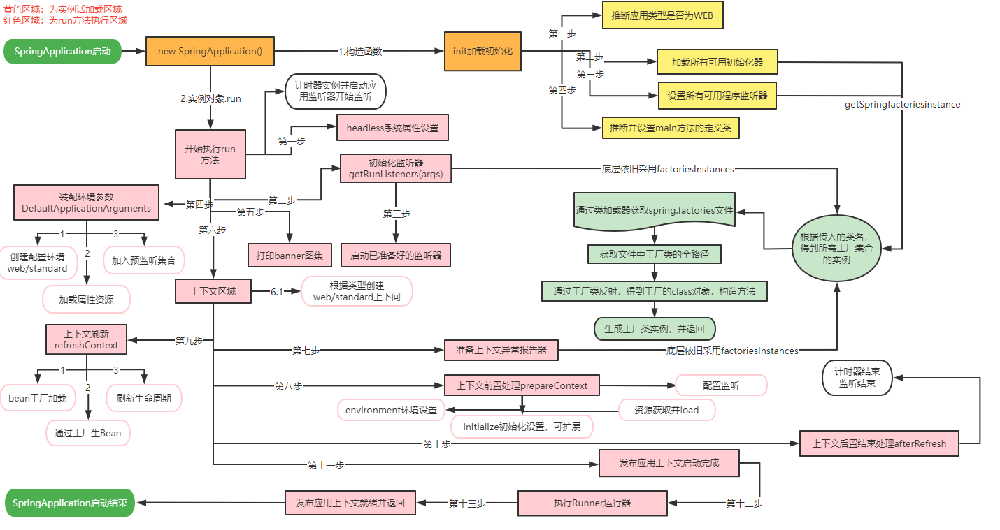

## SpringBoot自动装配原理

springboot所有自动配置都是在启动的时候扫描并加载；spring.factories所有的自动配置类都在这里面，但是不一定生效，要判断条件是否成立，只要导入了对应的start,就有对应的启动器了，有了启动器，我们自动配置就会生效，然后就配置成功了。

1. springboot在启动的时候，从类路径下/META-INF/spring.factories获取指定的值
2. 将这些自动配置的类导入容器，自动配置就会生效，帮我们进行自动配置
3. 以前我们需要自动配置的东西，现在springboot帮我们做了
4. 整合javaEE，解决方案和自动配置的东西都在spring-boot-autoconfigure-2.7.0.jar这个包下
5. 它会把所有需要导入的组件，以类名的方式返回，这些组件就会被添加到容器中
6. 容器中也会存在非常多的xxxAutoConfiguration的文件（@Bean）,就是这些类给容器中导入了这个场景需要的所有组件；并自动配置，@Configuration， JavaConfig!
7. 有了自动配置类，免去了我们手动编写配置文件的工作！

## SpringBoot启动原理

SpringApplication这个类主要做一下四件事情
1. 推断应用的类型是普通的项目还是Web项目
2. 查找并加载所有可用初始化器，设置到initializers属性中
3. 找出所有的应用程序监听器，设置到listeners属性中
4. 推断并设置main方法的定义类，找到运行的主类

## SpringBoot Web开发
1. 在SpringBoot，我们可以使用以下方式处理静态资源
    - webjars    	localhost:8080/webjars/
    - public, startic, /** ,resources  localhost:8080/
2. 优先级： resources > static(默认) > public